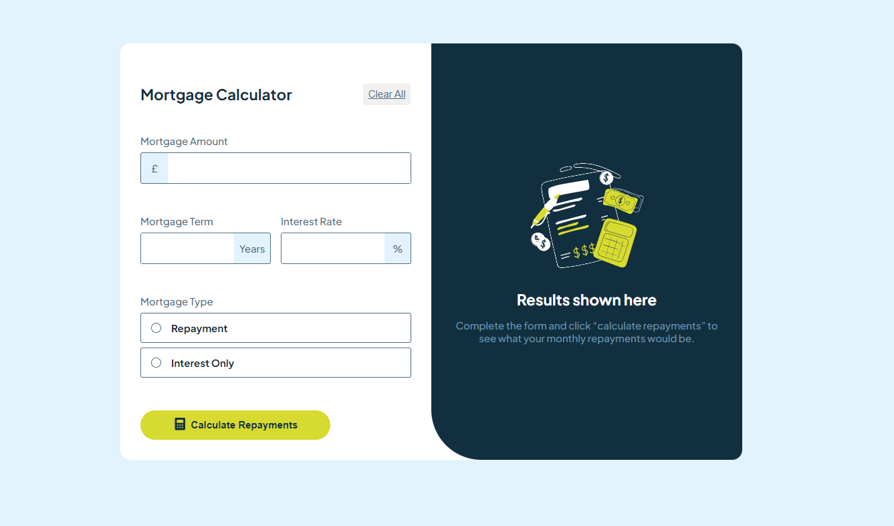
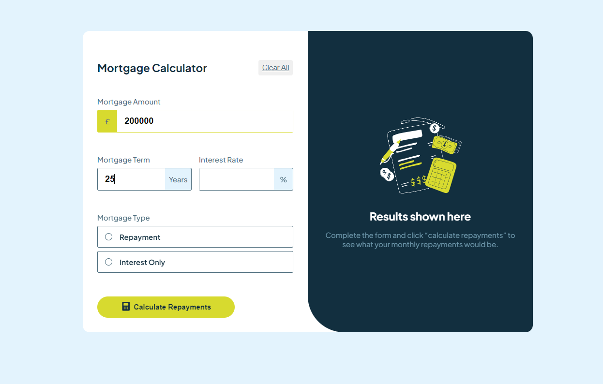
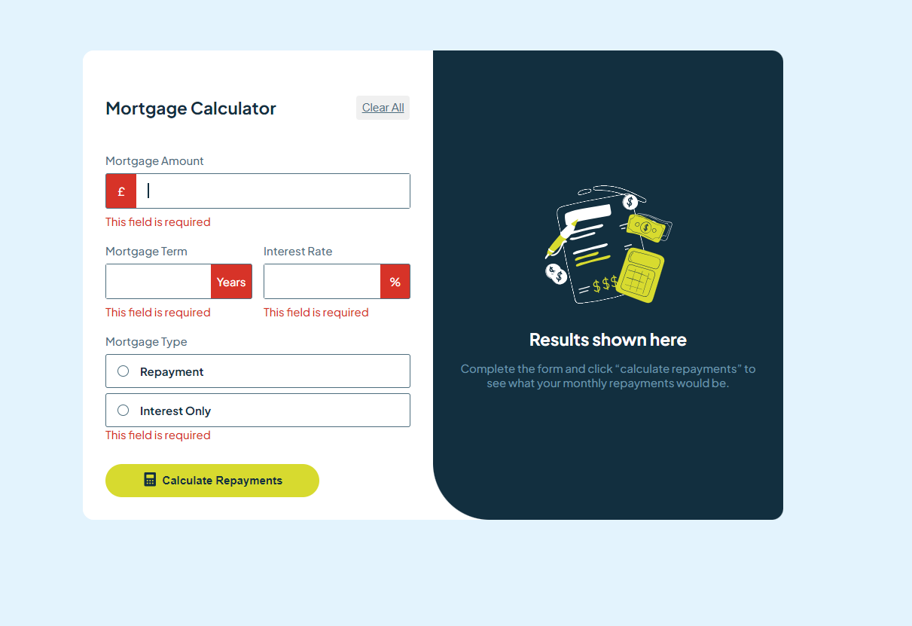
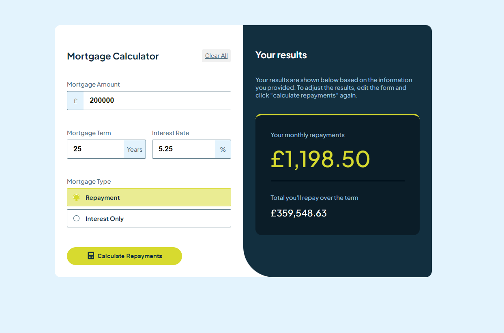
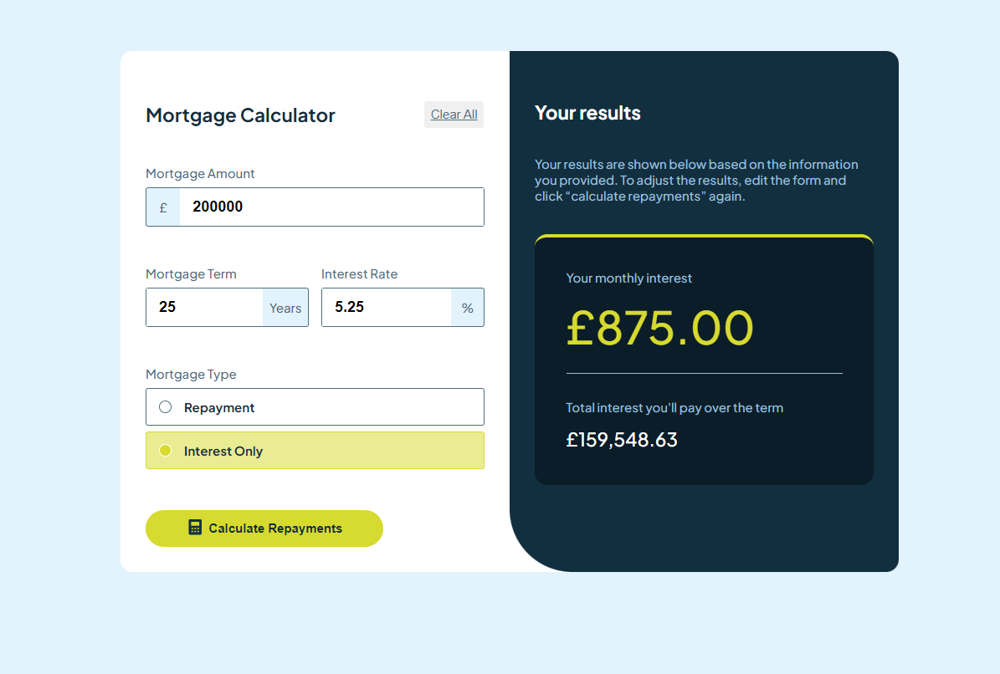
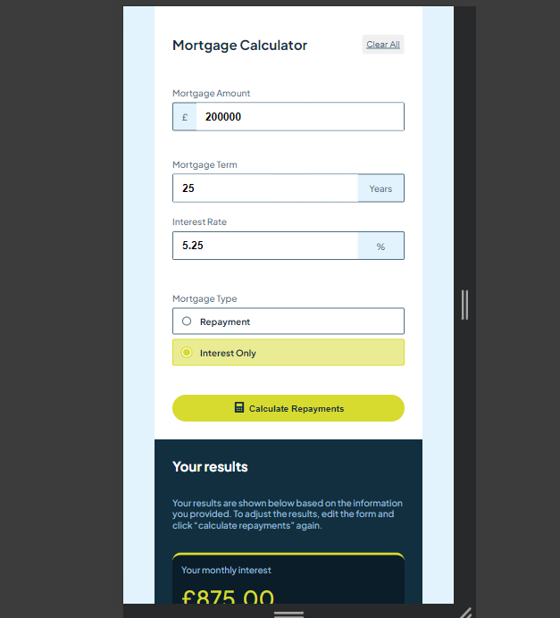
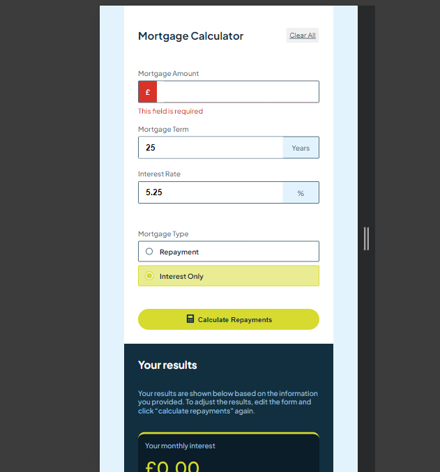

# Frontend Mentor - Mortgage repayment calculator solution

This is a solution to the [Mortgage repayment calculator challenge on Frontend Mentor](https://www.frontendmentor.io/challenges/mortgage-repayment-calculator-Galx1LXK73). Frontend Mentor challenges help you improve your coding skills by building realistic projects.

## Table of contents

- [Overview](#overview)
  - [The challenge](#the-challenge)
  - [Screenshot](#screenshot)
  - [Links](#links)
- [My process](#my-process)
  - [Built with](#built-with)
  - [What I learned](#what-i-learned)
  - [Continued development](#continued-development)
  - [Useful resources](#useful-resources)
- [Author](#author)
- [Acknowledgments](#acknowledgments)

## Overview

### The challenge

Users should be able to:

- Input mortgage information and see monthly repayment and total repayment amounts after submitting the form
- See form validation messages if any field is incomplete
- Complete the form only using their keyboard
- View the optimal layout for the interface depending on their device's screen size
- See hover and focus states for all interactive elements on the page

### Screenshot









## My process

### Built with

- **[Vite](https://vitejs.dev/)** - Next Generation Frontend Tooling for fast builds and optimized production output.
- **[React](https://reactjs.org/)** - A JavaScript library for building component-based user interfaces with fast rendering.
- **[styled-components](https://styled-components.com/)** - A CSS-in-JS library for writing styled components directly within JavaScript.
- **[react-hook-form](https://react-hook-form.com/)** - A performant library for managing form validation and submission, optimized for minimizing re-renders.
- **[Context API & Reducers (custom)](https://reactjs.org/docs/context.html)** - Used to manage global state related to mortgage data, along with reducers for handling actions like updating mortgage amount, term, rate, and selected type.
- **MortgageContext (custom)** - A custom implementation of the Context API to manage and share mortgage-related data globally across components.
- **[ESLint](https://eslint.org/)** - A tool to ensure code quality and consistency by enforcing best practices and identifying problematic patterns.
- **[Plus Jakarta Sans](https://fonts.google.com/specimen/Plus+Jakarta+Sans)** - A modern sans-serif typeface used for improved readability and aesthetic appeal.
- **[Google Fonts](https://fonts.google.com/)** - Webfont service integrated for easy access to custom fonts.
- **JavaScript (ES Modules)** - Utilizes ES modules for better modularity, maintainability, and performance.
- **Responsive Design** - The application is built to be fully responsive, ensuring a seamless experience across various devices, from mobile to desktop.

### What I learned

```css
input {
	max-width: 100%;
  width: 100%;
	height: 3rem;
	border-radius: 0.2rem;
	border: 1px solid var(--Slate-700);
	font-weight: var(--Bold);
	font-size: 1.2rem;
	border: none;
  border-radius: 0;
  color: var(--Slate-900);

 &:focus{
		outline: none;
	}

	 /* To remove autofill background color */
	 &:-webkit-autofill {
    -webkit-box-shadow: 0 0 0px 1000px var(--White) inset;
    box-shadow: 0 0 0px 1000px var(--White) inset;
    background-color: var(--White) !important;
    color: var(--Slate-900) !important;
  }

  &:-webkit-autofill:focus {
    -webkit-box-shadow: 0 0 0px 1000px var(--White) inset;
    box-shadow: 0 0 0px 1000px var(--White) inset;
  }
	}
`;

```

```js
//Custom hook for calculating mortgage repayments and interest

function usePayments() {
	const { mortgageAmount, mortgageRate, mortgageTerm } = useMortgage();

	const numberOfPayments = Number(mortgageTerm) * 12;
	const monthlyInterestRate = Number(mortgageRate) / 100 / 12;
	//Monthly repayments
	const monthlyRepayment =
		(Number(mortgageAmount) *
			monthlyInterestRate *
			Math.pow(1 + monthlyInterestRate, numberOfPayments)) /
		(Math.pow(1 + monthlyInterestRate, numberOfPayments) - 1);
	//Interest only
	const monthlyInterest = Number(mortgageAmount) * monthlyInterestRate;

	//Total
	const totalRepayment = numberOfPayments * monthlyRepayment;
	const totalInterest = totalRepayment - Number(mortgageAmount);

	return { monthlyRepayment, monthlyInterest, totalRepayment, totalInterest };
}
```

## Author

- Frontend Mentor - [@Tamar86](https://www.frontendmentor.io/profile/Tamar86)
